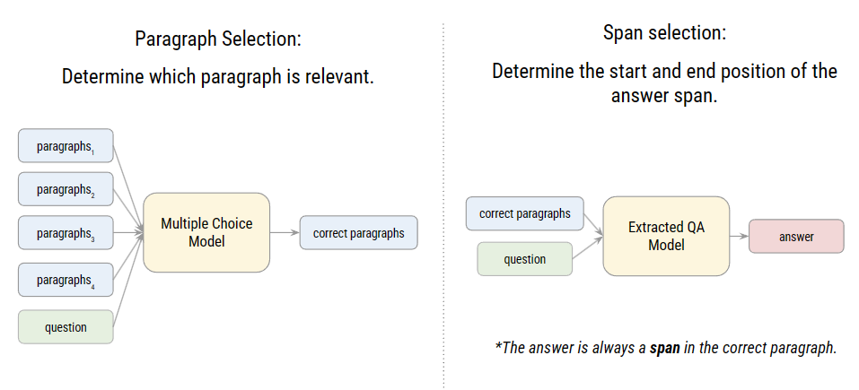

# HW1 - Chinese Extractive Question Answering (QA)

## 1. Description
Extract answers from given text based on provided questions.



### Task 1. Paragraph Selection
Determine which paragraph is relevant. For each question, view a paragraph-question pair as a choice, and then ask the model to predict the correct choice.

### Task 2. Span Selection (Extractive QA)
Determine the start and end position of the answer span. Use the start position to identify the answer span.

## 2. Execution

### download.sh 
Download models, tokenizers and data. Execute download.sh before running any other scripts.

### run.sh
Perform inference using your trained models and output predictions on test.json.

3 arguments are required:
- "${1}": path to context.json.
- "${2}": path to test.json.
- "${3}": path to the output prediction file named prediction.csv.

Predict testing data as follows:
```bash
bash ./download.sh
bash ./run.sh /path/to/context.json /path/to/test.json /path/to/pred/prediction.csv
```

### README.md
Contain step-by-step instruction on how to train model with the codes/scripts.
