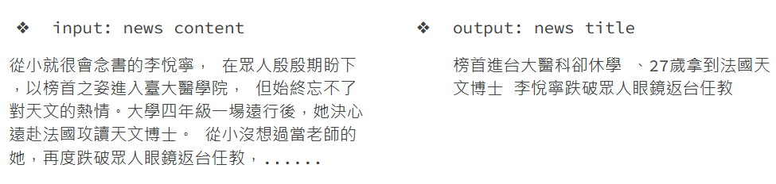

# HW2 - Chinese News Summarization (Title Generation)

## 1. Description
Generate title for the given article.




## 2. Execution

### download.sh 
Download models, tokenizers and data. Execute download.sh before running any other scripts.

### run.sh
Arguments:
 - ${1}: path to the input file
 - ${2}: path to the output file
 
Predict testing data as follow:
```bash
bash ./download.sh
bash ./run.sh /path/to/input.jsonl /path/to/output.jsonl
```

### README.md
Contain step-by-step instruction on how to train model with the codes/scripts.
