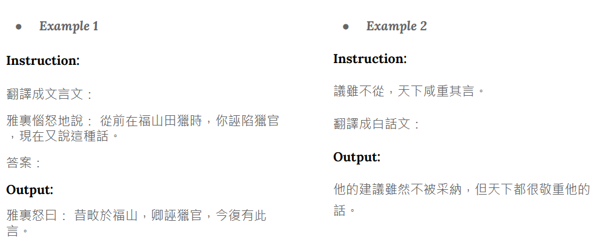

# HW3 - Instruction Tuning (Classical Chinese)

## 1. Description
Apply instruction tuning with QLoRA on Taiwan-LLaMa to perform Classical Chinese translation.




## 2. Execution

### download.sh 
Download  or create a folder called adapter_checkpoint which contains peft configuration file (adapter_confi.json) and weights (adapter_model.bin). Execute download.sh before running any other scripts. After running download.sh, the adapter_config.json and adapter_model.bin should be in adapter_checkpoint.
```bash
├── other code/script
└── adapter_checkpoint
    ├── adapter_config.json
    └── adapter_model.bin
```
### utils.py
1. def get_prompt(instruction: str) -> str:
return the prompt to input into the LLM
2. def get_bnb_config() -> BitsAndBytesConfig:
return your bnb configuration

### run.sh
Perform text generation using your trained models and output predictions on testing file (.json)

Arguments
 - ${1}: path to the Taiwan-LLaMa checkpoint folder
 - ${2}: path to the adapter_checkpoint downloaded under your folder
 - ${3}: path to the input file (.json)
 - ${4}: path to the output file (.json)

Predict testing data as follow:
```bash
bash ./download.sh
bash ./run.sh /path/to/Taiwan-LLaMa-folder /path/to/adapter_checkpoint \ /path/to/input.json /path/to/output.json
```

### README.md
Contain step-by-step instruction on how to train model with the codes/scripts.
