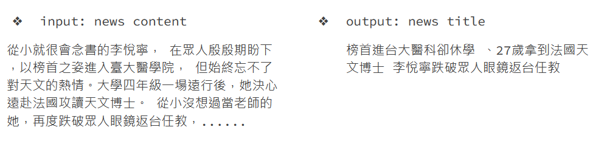
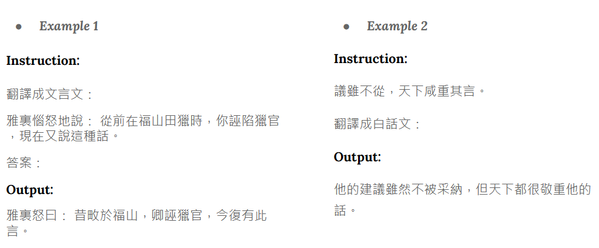

# Applied Deep Learning 2023

## HW1 - Chinese Extractive Question Answering (QA)
Extract answers from given text based on provided questions.

### Task 1. Paragraph Selection
Determine which paragraph is relevant.

### Task 2. Span Selection (Extractive QA)
Determine the start and end position of the answer span. 

## HW2 - Chinese News Summarization (Title Generation)
Generate title for the given article.

## HW3 - Instruction Tuning (Classical Chinese)
Apply instruction tuning with QLoRA on Taiwan-LLaMa to perform Classical Chinese translation.

## Final Project - ShotGMP