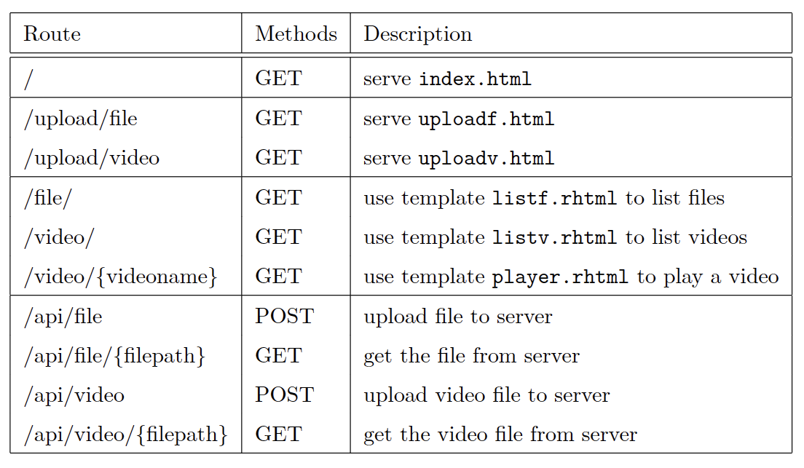
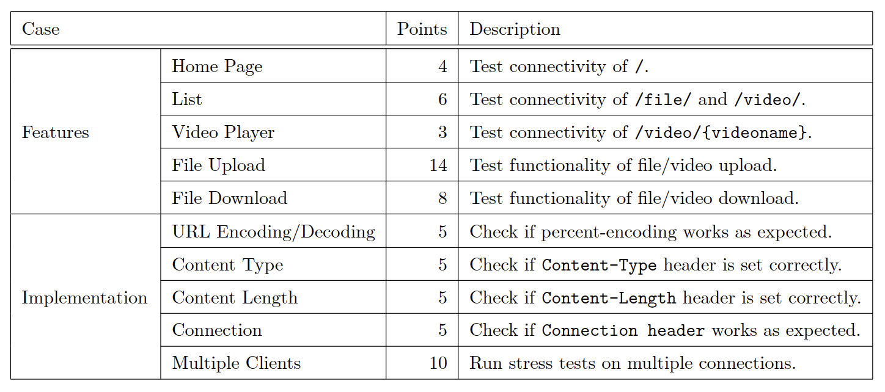
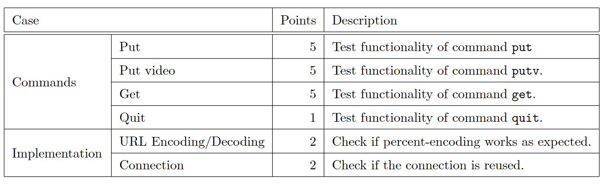

# HW2 - HTTP Server & DASH Client

## Description
[HW2 Problemsheet](pic/HW2-ProblemSheet.pdf)

Design both the HTTP server and the client to achieve the following goals:

 - The server can serve static web page index.html, uploadf.html, uploadv.html.
 - The server can serve dynamic web pages listf.rhtml, listv.rhtml, player.rhtml.
 - The server can serve text/binary files (including DASH videos).
 - The server can handling multiple clients
 - Implement HTTP basic authentication on the server.
 - The client can upload files and videos to the server.
 - The client can fetch files from the server.
 
The server and the client use HTTP 1.1 as
the protocol for information exchange. The server serves multiple types of files, including the DASH videos.

There might be multiple, various clients (e.g., the client implemented and browsers like Google Chrome, Microsoft Edge) establishing connections with the server at the same time.

### Server Routing Table

### Server Evaluation

### Client Evaluation


## URL Encoding / Decoding
All the symbols in URL expect [A-Z][a-z][0-9][-_.~] should be encoded by using percent-encoding8.

Percent-encoding a reserved character involves converting the character to its corresponding byte value in
ASCII and then representing that value as a pair of hexadecimal digits.

The digits, preceded by a percent sign % as an escape character, are then used in the URI in place of
the reserved character. 

For example, the path /path/to/the/file/hello world.txt should be encoded as
/path/to/the/file/hello%20world.txt.

## MPEG-DASH
DASH is a suite of standards providing a solution for multimedia streaming using existing HTTP infrastructure. The multimedia content is stored on an HTTP server and is delivered using HTTP. The content on the server can be grouped into
two parts:
 - **Media Presentation Description (.mpd file)** which describes a manifest of the available content, its various alternatives, their URL addresses, and other characteristics.
 - **Video segments (e.g., .m4s files)** which contain the actual multimedia bitstreams in the form of chunks, in single or multiple files

To play the content, the DASH client first obtains the .mpd file, which contains the media types, resolutions, bandwidths, and many other characteristics of the content. Using this information, the DASH client
selects the appropriate encoded alternative and starts streaming the content by fetching the segments using
HTTP GET requests.

After appropriate buffering to allow for network throughput variations, the client continues fetching the subsequent segments and monitors the bandwidth fluctuations of the network. Depending on its measurements, the client decides how to adapt to the available bandwidth by fetching segments of different
alternatives (with lower or higher bitrate) to maintain an adequate buffer.

## Commands
### put
The client should upload the file specified in the argument to the server endpoint /api/file.
```bash
> put
Usage: put [file]
> put a.file.that.does.not.exist
Command failed.
> put hello world.txt
Command succeeded.
```
### putv
The client should upload the video file specified in the argument to the server
endpoint /api/video.
```bash
> putv
Usage: putv [file]
> putv a.mp4.that.does.not.exist
Command failed.
> putv my -video (1).mp4
Command succeeded.
```
### get
The client should download the file specified in the arguments from the server endpoint /api/file/{filepath}. The downloaded file should be saved in hw2/files.
```bash
> get
Usage: get [file]
> get a.file.that.does.not.exist
Command failed.
> get hello world.txt
Command succeeded.
```
### quit
For the quit command, the client should close the socket to the server and terminate the process.
```bash
> quit
Bye.
```