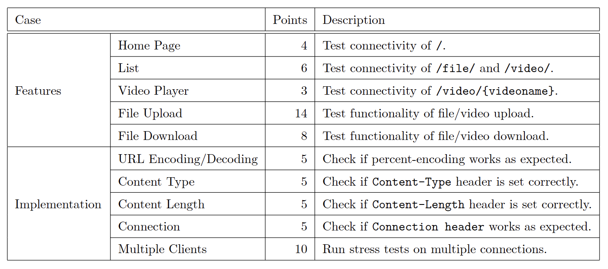
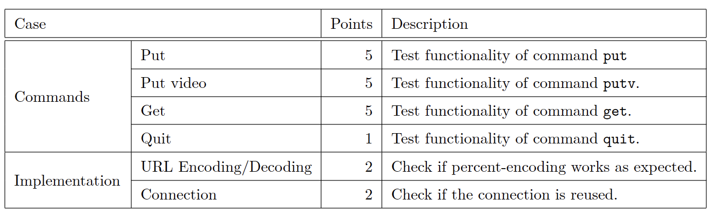

# Computer Networks 2023

## HW2 - HTTP Server & DASH Client
Design the HTTP server and the client with **URL Encoding / Decoding** and **MPEG-DASH** to achieve the following goals:

 - The server can handling multiple clients
 - Implement HTTP basic authentication on the server.
 - The client can upload files and videos to the server.
 - The client can fetch files from the server.

### Commands
 - **put** - The client upload the file.
 - **putv** - The client upload the video file.
 - **get** - The client download the file.
 - **quit** - The client close the socket to the server and terminate the process.
 
### Server Routing Table

### Server Evaluation

### Client Evaluation

# HW3 - File transmission and Hashing system
Implement a file transmission and hashing system with the following features:  
 - reliable transmission.
 - SACK protocol (Selective Acknowledgment)
 - Congestion Control
 - Hashing and Storing File
 - Buffer Handling
